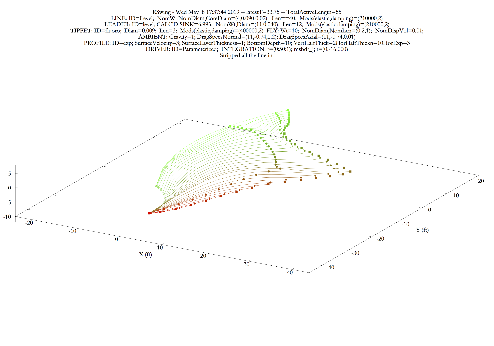
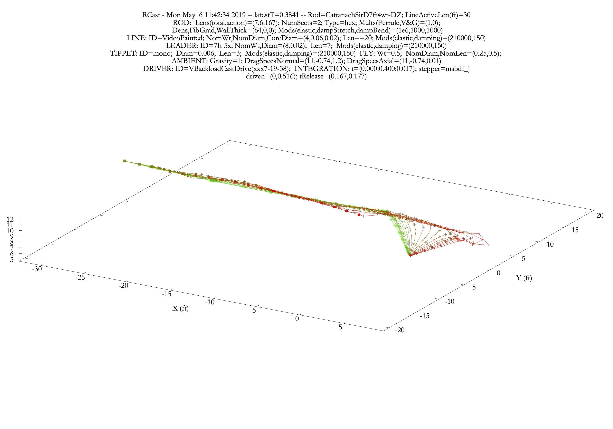

[Home](https://rhexman.github.io)

### RHex - Fly fishing related dynamic simulations

The applications of the RHex project create realistic dynamic 3D computer simulations that will interest both fly fishers and fly-rod builders.  There are two main applications, RHexSwing3D and RHexCast3D.

The first shows the behavior of a fly-line, leader, tippet, and fly combination that is laid down on the surface of a stream and then allowed to swing under the influence of the stream's various water velocities, rod tip motion and line stripping. The results of these simulations give insight into the effects of line setup, fly choice and fisher action on fly presentation. Some of the things you see are likely to surprise you. Although the primary focus of this simulation is on swung streamers, the program can also be used to elucidate czech and indicator nymphing.

The second application displays the behavior of a fly rod and line combination during an aerial cast as they respond to motions of the rod handle.  This simulation has much to say about the details of rod and line design, as well as to casting technique.

### Prerequisites

RHex has different prerequisites for machines running Mac and Windows operating systems.

On the Mac, the RHex applications all draw into windows provided by XQuartz and you need to have the latest version of XQuartz in order to run them. Aside from this, the Mac executable packages are entirely self-contained.  If you are not sure you have XQuartz, download and install RHex as described below, launch RHexReplot3D, hit the RUN button, and see what happens.  If a plot appears, you're ok.  If not, go to https://www.xquartz.org/ and click the download link.

In Windows, drawing goes into native windows, and there is nothing to do there.  However, RHex drawing is mediated by by the Gnuplot program which must be present on your system. As with the Mac, after downloading RHex, you can test for Gnuplot by launching RHexReplot3D.  If you get a complaint instead of seeing the control panel, you will need to install Gnuplot.  Go to https://sourceforge.net/projects/gnuplot/files/gnuplot/5.2.6/ and hit the green "Download Latest Version" button.

### Distribution

You can find downloads of the RHex executable packages by clicking the link

[RHex_Exe-0.1.0 Releases](https://github.com/RHexMan/RHex/releases)

This will take you to the RHex GitHub releases page.  Click on the word "Assets", then click on the appropriate executable zip.  Once the zip arrives on your machine, move it to a suitable location and double click the file to unzip.  A folder with nearly the same name will appear next to the zip file.  Enter the folder and, in any text editor, read the README_EXE_INSTALL.md file.

On Macs running OS X 10.11 (El Capitan) and earlier, in order to download and run applications from the internet that are not from the Apple Store or from the Apple sanctioned developers, you need to have a preference setting that allows downloads from anywhere.  To see the settings choices, go to the Apple Menu and select System Preferences, and then select the Security and Privacy Pane.  In that pane, you need to choose the radio button that allows apps downloaded from __anywhere__.  In order to change the button selection, you need to click the lock icon and enter an admin password.  After you have completed the download, run the installation script, and run each of the three applications, you can return to the Security pane and restore the original button choice.

On Macs running OS X 10.12 (Sierra) and later, the option to download from anywhere is hidden. When you download and attempt to run, you see a message saying the application cannot be opened because your security settings do not allow it. The simplest solution is to “OK” the message and immediately go to Apple Menu > System Preferences > Security & Privacy, where the application in question is listed with an option to open it anyway. Pressing “Open Anyway” brings one more message trying to persuade you to give up on this. But if you insist, you can run the application ever after. However, every run will be preceded by another warning message.

If you don't want the bother of agreeing to run each time, you can do the following before attempting the download:  Open the Terminal application (found in /Applications/Utilities). Copy the following line of code

`sudo spctl --master-disable`

Then click on the terminal window and paste.  This will write the copied text just after the dollar sign.  Hit the \<return\> key.  You will be asked to enter your admin password.  After you have done that, downloads from anywhere will be allowed.  When you have finished downloading and installing this package, and have run each of the three applications once, you may return the system to its original state by copying and pasting this:
  
`sudo spctl --master-enable`
 
 followed by \<return\>.  You can then quit Terminal.

### Some details

Each program has an interactive control panel that allows setting, saving, and retrieving of complex parameter sets, running the simulations, and plotting and saving the results, both as text and as static graphic files. The primary outputs of these programs are 3D mouse-rotatable plots that show the rod and/or line as a sequence of traces representing the component configuration at equally spaced times. The earliest traces are shown in green and the latest in red, with the intermediate ones shown in brownish shades that are the combination of green and red in appropriate proportion. Open circles, solid circles, diamonds and squares mark the locations of the rod tip, line-leader and leader-tippet junctions, and the fly. In addition to the rotation, the plots may be zoomed and translated in real time, which allows comprehensive inspection of the data.

An auxilliary program, RHexReplot3D, allows the replotting of saved text data, with a possibly  reduced time range and frame rate.

The control panel of each of the programs has a help menu in an upper corner which gives access to a general discussion of the program, its license, detailed descriptions of the user-settable parameters, including their allowed and typical value ranges, and an exposition on gnuplot view manipulations.

RHexCast3D and RHexSwing3D both make use of external files that allow nearly complete freedom to customize the details of the rod and line setup and driving motion. The distribution includes a number of folders that organize these files and that contain examples. Except for one sort of rod driving specification which requires a graphics editor, all the files are text, and can be opened, read and written with any standard text editor. Each example file has a header with explanatory information. The idea is that when you want a modified file, you copy the original, make changes in your copy, and save it, with a different name, to the same folder.

### History

The RHex project was written between 2013 and 2019 by Rich Miller.  It was preceded by the static Hexrod project of Wayne Cattanach, which was itself a computer updating in BASIC of the historical hand calculations of Garrison (see "A Master's Guide to Building a Bamboo Fly Rod", Everett Garrison and Hoagy B. Carmichael, first published in 1977). Frank Stetzer translated Cattanach's code into CGI/Perl in 1997, and continues to maintain and upgrade it (www.hexrod.net).

### Sample static plots showing parameter settings

